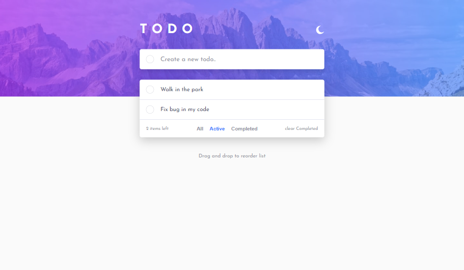

# Frontend Mentor - Todo app solution

This is a solution to the [Todo app challenge on Frontend Mentor](https://www.frontendmentor.io/challenges/todo-app-Su1_KokOW). Frontend Mentor challenges help you improve your coding skills by building realistic projects.

## Table of contents

- [Overview](#overview)
  - [The challenge](#the-challenge)
  - [Links](#links)
- [My process](#my-process)
  - [Built with](#built-with)
  - [What I learned](#what-i-learned)
  - [Continued development](#continued-development)
  - [Useful resources](#useful-resources)
- [Author](#author)
- [Acknowledgments](#acknowledgments)

## Overview

### The challenge

Users should be able to:

- View the optimal layout for the app depending on their device's screen size
- See hover states for all interactive elements on the page
- Add new todos to the list
- Mark todos as complete
- Delete todos from the list
- Filter by all/active/complete todos
- Clear all completed todos
- Toggle light and dark mode
- **Bonus**: Drag and drop to reorder items on the list

### Links

- Solution URL: [Solution](https://github.com/naijadevgamer/todo-app)
- Live Site URL: [Todo app](https://naijadevgamer.github.io/todo-app/)

### Screenshot



## My process

### Built with

- Semantic HTML5 markup
- SCSS custom properties
- Flexbox
- Desktop-first workflow
- [React](https://reactjs.org/) - JS library
- [React beautiful dnd](https://www.npmjs.com/package/react-beautiful-dnd) - JS library

### What I learned

- Easy creation and implementation of Theme switching

```css
[data-theme="dark"] {
  --background-inner: hsl(235, 24%, 19%);
  --text-primary: hsl(234, 39%, 85%);
  --text-secondary-hover: hsl(236, 33%, 92%);
  --text-secondary: hsl(234, 11%, 52%);
  --circle-border: hsl(233, 14%, 35%);
  --line-border: hsl(237, 14%, 26%);
}
```

### Continued development

- Use of react hooks like useEffect.
- Theme toggle switching.
- Creating another state to filter todos.
- Use of react beautiful dnd with strict mode.

### Useful resources

- [React beautiful dnd](https://www.npmjs.com/package/react-beautiful-dnd) - This react library helped me in making a beautiful drag and drop on my tasks list, I really liked this pattern and will use it going forward.

## Author

- Frontend Mentor - [@naijadevgamer](https://www.frontendmentor.io/profile/naijadevgamer)
- Twitter - [@naijadevgamer](https://www.x.com/naijadevgamer)
- LinkedIn - [Abdullah Saleeman](https://www.linkedin.com/in/abdullah-saleeman-360170243)

## Acknowledgments

Special thanks to the Almighty Allah for guidance and support throughout this project.
